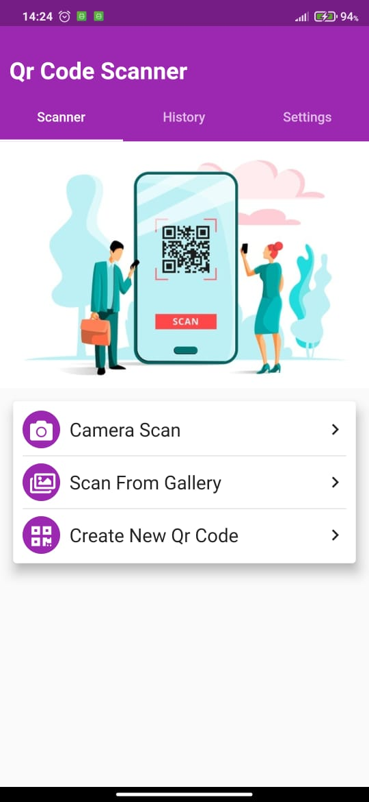
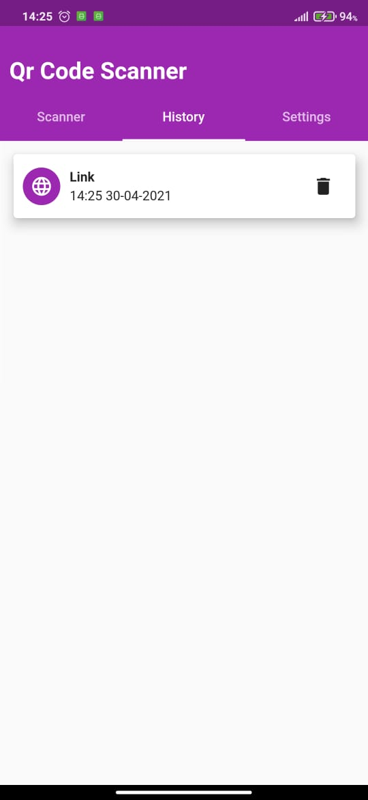
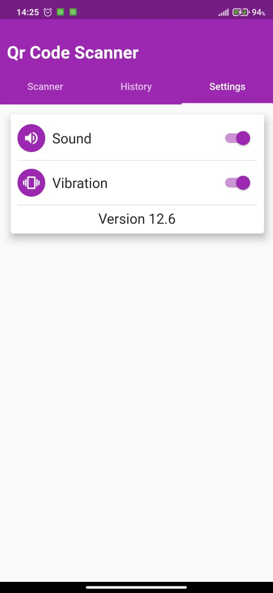
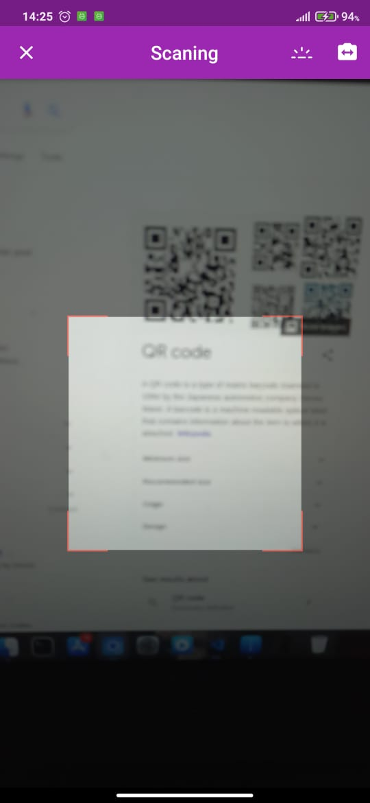

## Qr Code Scanner

Another Flutter project for scanning QR codes from camera or device and distinguish between them by type, also
it can be used to create a new QR code, with some cool features like sharing, history, playing sounds when it recognizes a QR code.

<br />

The app already on [Play Store](https://play.google.com/store/apps/details?id=com.spiderzapps.qrcodescanner)

<br />

<div align="center">
  
  
  
  
  
  
</div>


## Testing

```bash
git clone https://github.com/anasmassnaoui/Qr-Code-Scanner.git
cd Qr-Code-Scanner
flutter pub get
flutter run
```

## Customizing

```bash
# to change package name
flutter pub run change_app_package_name:main com.new.package.name
# to change splash screen
# update flutter_native_splash section on pubspec.yaml
flutter pub run flutter_native_splash:create
# to change app icon
# update flutter_icons section on pubspec.yaml
flutter pub run flutter_launcher_icons:main
```

```dart
// to change app colors
// update the following code on lib/main.dart
ThemeData(
    primaryColor: Colors.purple,
    primaryColorDark: Colors.purple,
    accentColor: Colors.purple,
)
```

PS: 
- Admob already implemented
- IOS Version not tested yet
